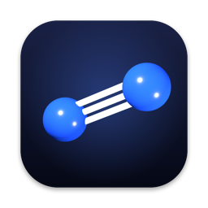
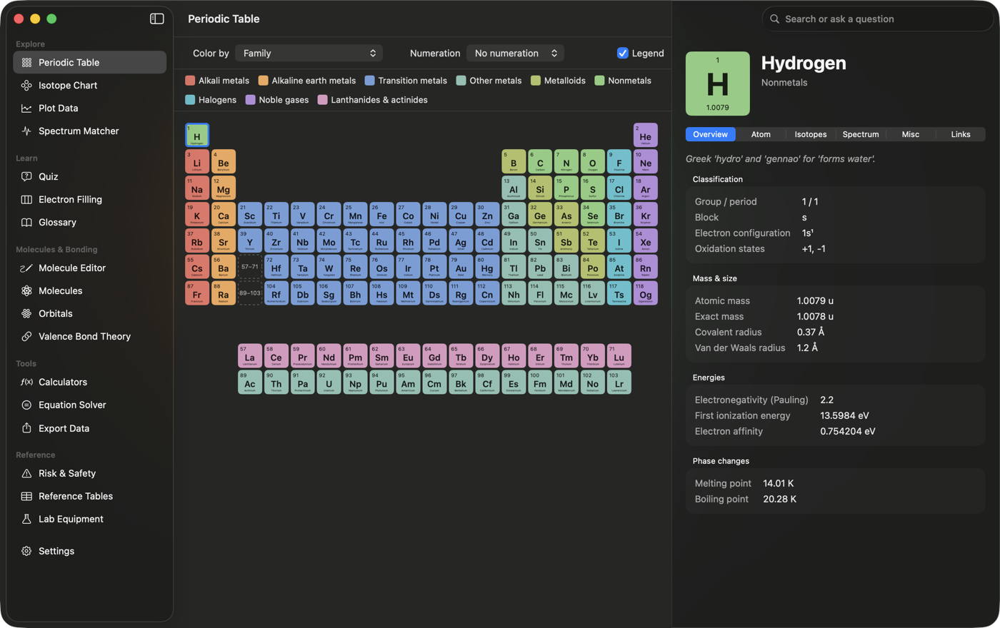
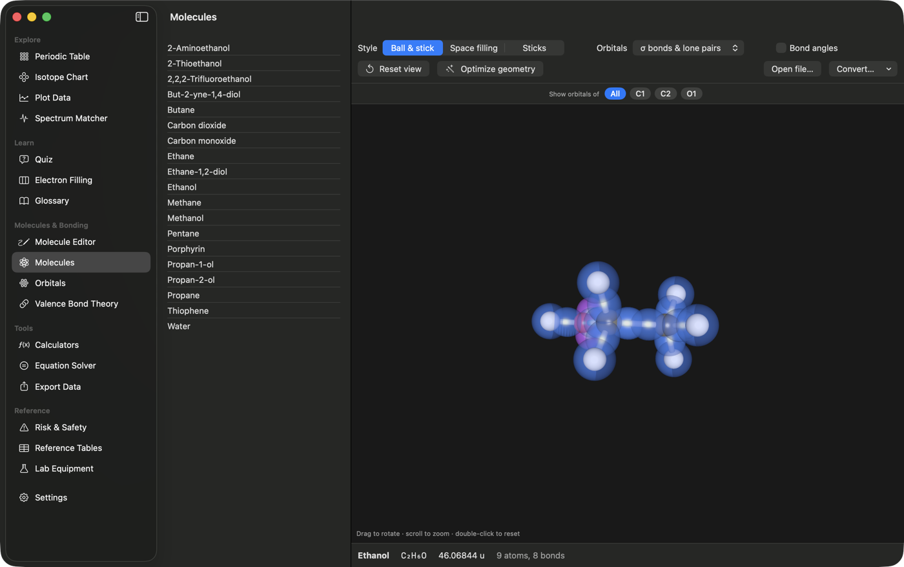
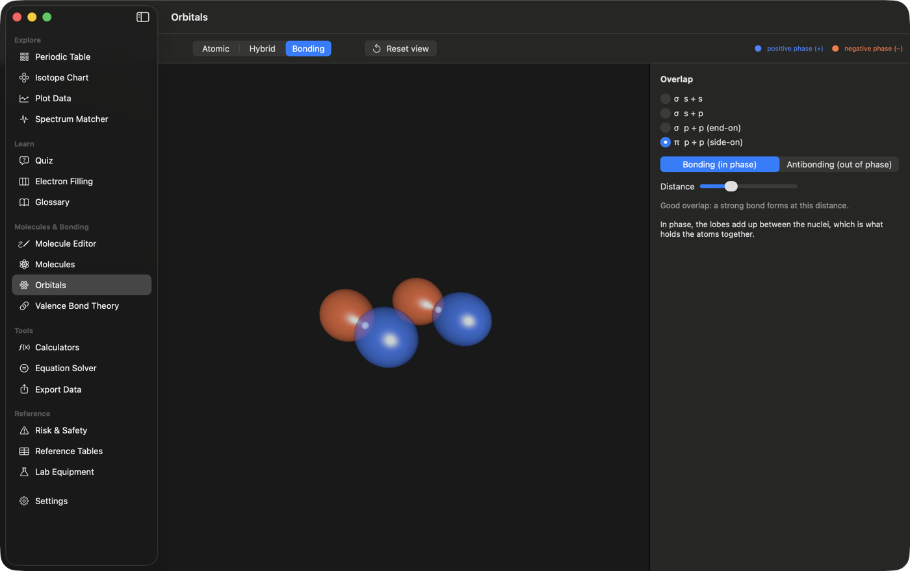
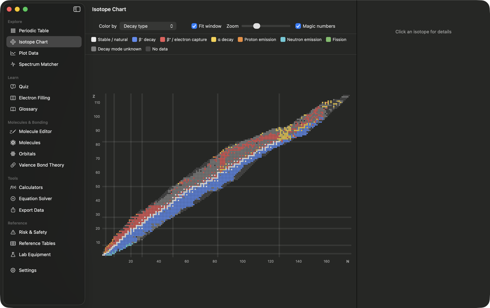
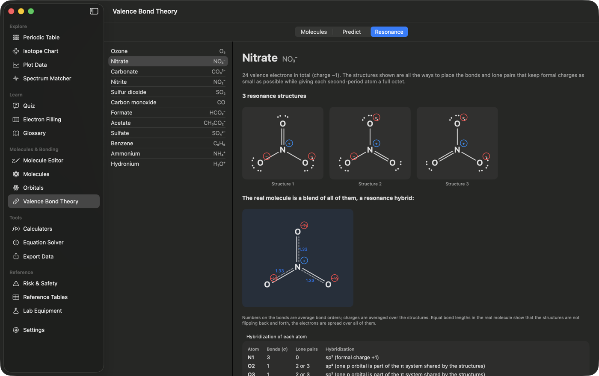
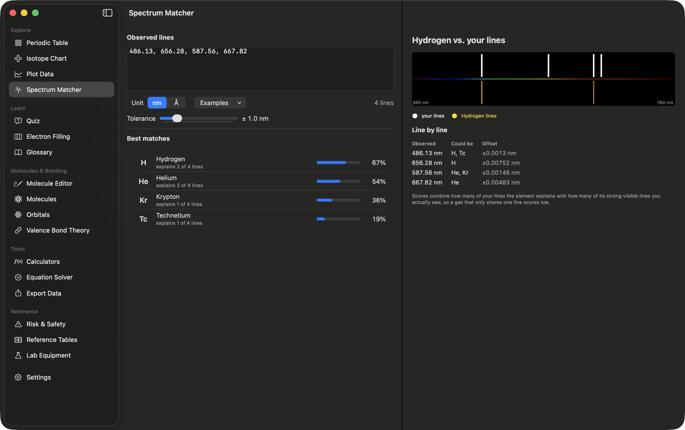
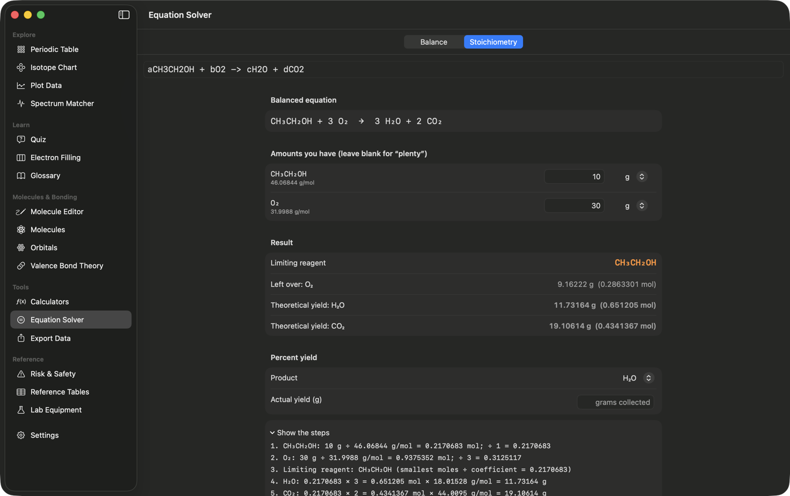

<p align="center">
  
</p>

<h1 align="center">Xenon</h1>

<p align="center">
  <b>A chemistry reference and learning app</b><br>
  Periodic table · isotopes · spectra · equation solver · quizzes · molecule editor · 3D molecules &amp; orbitals · valence bond theory
</p>

<p align="center">
  <a href="https://github.com/alexidako/Xenon/actions/workflows/desktop.yml"></a>
  
  
  
  
</p>

<p align="center">
  
</p>

A port of [KDE Kalzium](https://apps.kde.org/kalzium/) with a lot added on top: natural-language element search, a spectrum
matcher, stoichiometry, a molecule editor, 3D orbital views, valence bond theory with resonance structures, and a
geometry optimizer that finds the most stable 3D shape of a molecule. Built by pupper, 2026, with Claude Code.

## 🎨 A look around

<table>
  <tr>
    <td width="50%"><br><sub><b>3D molecules</b> with σ, lone-pair and π orbitals</sub></td>
    <td width="50%"><br><sub><b>Orbitals:</b> atomic, hybrid and bonding overlap</sub></td>
  </tr>
  <tr>
    <td><br><sub><b>Isotope chart</b> by decay type, half-life or abundance</sub></td>
    <td><br><sub><b>Resonance &amp; formal charges</b></sub></td>
  </tr>
  <tr>
    <td><br><sub><b>Spectrum matcher:</b> which gas is in the tube?</sub></td>
    <td><br><sub><b>Stoichiometry</b> with every step shown</sub></td>
  </tr>
</table>

<sub>Screenshots are from the macOS version; the Windows, Linux and web version has the same screens.</sub>

## 📥 Get it

Go to the **[Releases page](https://github.com/alexidako/Xenon/releases)**, open the newest release and download the file for your system under **Assets**:

| Your system | Download |
| --- | --- |
| 🪟 **Windows** | `Xenon_…_x64-setup.exe` (installer) or `Xenon_…_x64_en-US.msi` |
| 🍎 **macOS** (Apple Silicon and Intel) | `Xenon_…_universal.dmg`: open it and drag Xenon to Applications |
| 🐧 **Linux** | `Xenon_…_amd64.AppImage` (any distribution: make it executable and run it), `.deb` (Debian, Ubuntu) or `.rpm` (Fedora, openSUSE) |
| 🌐 **In a browser** | run it from source, no install of the app itself: `cd web && npm install && npm run dev` (see `web/README.md`) |
| 🛠️ **Mac, native SwiftUI version** | build it from source with the commands below |

The apps are not code-signed, so Windows SmartScreen and macOS Gatekeeper warn on first launch (details in `web/README.md`).

## 🍎 Build the Mac app from source

```bash
swift run                      # run from source
./scripts/package-app.sh       # build Xenon.app (release, ad-hoc signed)
```

Requires macOS 14+ and the Swift toolchain (Xcode or Command Line Tools). Windows, Linux and browser users: see `web/README.md`.

## Getting around

Keyboard shortcuts (Mac uses ⌘; Windows and Linux use Ctrl):

| Action | macOS | Windows / Linux |
| --- | --- | --- |
| Quick lookup: type an element, glossary term, lab tool, molecule or screen name, then press Return | ⌘K | Ctrl+K |
| Jump to the first ten screens (the sidebar shows each number) | ⌘1 … ⌘0 | Ctrl+1 … Ctrl+0 |
| Settings | ⌘, | Ctrl+, |
| Undo / redo in the molecule editor | ⌘Z / ⇧⌘Z | Ctrl+Z / Ctrl+Shift+Z |
| Answer a quiz question | 1 – 4 | 1 – 4 |
| Reset the 3D view | double-click | double-click |

The app reopens on the screen you left. **Settings** also chooses display units: K / °C / °F, eV / kJ·mol⁻¹ / kcal·mol⁻¹, Å / pm / nm.

## What is in it

| Area | Features |
|---|---|
| Periodic table | 6 color schemes (monochrome, blocks, family, groups, colors, iconic with SVG icons), 9 gradients, state of matter by temperature, discovery-date slider, IUPAC/CAS/old-IUPAC numeration, legend, search by name/symbol/number |
| Element details | Overview, atom model (Bohr shells), isotopes, spectrum (emission/absorption, range, nm/Å/µm/eV), misc, links |
| Ask in plain English | Type a question in the table search box: “liquid at room temperature”, “halogens discovered before 1850”, “melting point above 3000 K”, “heaviest noble gas”, “group 17”, “period 3 metals”. Rule-based, works offline; it says so when you ask for data the app does not have (e.g. density). |
| Electron filling | Build an element's electron configuration yourself by clicking orbital boxes. Pauli, Hund and Aufbau are enforced, and a broken rule is explained in words. Hint, "fill for me", and a *Strict Aufbau* switch: turn it off to build the real configurations of exceptions such as Cr, Cu, Pd and Au, which the app detects from the data and explains (half-filled / filled d subshell). |
| Quiz | 8 question types (symbol ↔ name, atomic number ↔ name, click the element on the table, families, periodic trends, electron configurations), a choice of 20 / 36 / 54 / 118 elements, rounds of 5–20, answer explanations, and a results review. Missed elements are remembered, and *Practise my weak spots* makes them come up more often. |
| Orbitals | 3D orbital shapes: s, p and d atomic orbitals, the sp / sp² / sp³ hybrid sets (sp³d and sp³d² schematic), and a **Bonding** view with σ (s+s, s+p, p+p) and π (p+p) overlap, in phase or out of phase, with a distance slider. Surfaces are the angular probability |ψ|², colored by the sign of ψ. The **Molecules** screen has an *Orbitals* menu (with atom chips to show just one atom's orbitals) that overlays any molecule (including ones drawn in the editor) with its σ lobes, lone pairs and π p-orbitals, placed from the 3D coordinates and valence bond analysis. Angular shapes only: no radial nodes or electron density. |
| Geometry optimizer & bond angles | In **Molecules**, **Optimize geometry** rearranges the atoms into the most stable 3D shape it can find. It uses a small molecular-mechanics force field (bond stretch, valence-bond-ideal angle bend, torsions: staggered sp³, flat double bonds and conjugated bonds, flat sp² centres, Lennard-Jones repulsion) with analytic forces and a FIRE minimizer, and searches many starting shapes (every rotatable bond spun, rings puckered into chairs and boats) and keeps the lowest energy: ethane comes out staggered, butane anti, cyclohexane a chair, benzene flat with 1.40 Å bonds. It is classical mechanics, not quantum chemistry, so it finds sensible shapes and relative strain, not exact energies. **Revert** restores the original coordinates. **Bond angles** draws an arc and the angle in degrees at every pair of bonds (with the atom chips to show just one atom's angles). |
| Molecule editor | Draw a molecule: click to place atoms, drag to bond (snaps to 30°), click a bond to cycle single/double/triple, Move and Erase tools, undo/redo, 12 templates. Hydrogens fill in from valence; over-bonded atoms are flagged. Shows formula (Hill order) and molar mass live. **View in 3D** generates 3D coordinates (bond lengths from covalent radii, angles from valence bond theory) and opens it in Molecules; **Analyze** sends it to Valence Bond Theory; **Save** writes CML/MOL/XYZ. Molecules you made or opened from a file are marked in the Molecules list and can be deleted (with a confirmation); the built-in ones can't. |
| Resonance & formal charges | The Valence Bond screen has a **Resonance** tab for ozone, nitrate, carbonate, nitrite, sulfur dioxide, carbon monoxide, formate, acetate, sulfate, benzene, ammonium and hydronium. It finds every lowest-formal-charge Lewis structure, draws each with lone pairs and charges, and shows the resonance hybrid (average bond orders and charges). Molecule analysis now assigns formal charges, so CO is C⁻/O⁺ instead of being refused. |
| Valence bond theory | Hybridization (sp to sp³d³), electron geometry and molecular shape, σ and π bonds, lone pairs, and the orbital-box diagram from ground state to hybridized. **Molecules** mode analyzes every bundled molecule and compares the predicted bond angles with the ones measured from its 3D coordinates. **Predict** mode takes any main-group atom plus its σ and π bond counts (e.g. XeF₄ → sp³d², square planar). Neutral main-group atoms only: ions and dative bonds such as CO need formal charges and are reported as unsupported. |
| Stoichiometry | In Equation Solver: balance, enter grams or moles of each reactant, get the limiting reagent, leftover, theoretical yield, percent yield, and every step |
| Spectrum matcher | Enter observed wavelengths (nm or Å) and get the elements that best explain them, with a line-by-line comparison; works for mixtures |
| Languages | The web, desktop and native Mac apps are available in **English, Русский, Українська, 简体中文, Español and Français**. The language follows your system by default; change it in **Settings → Language** (the Mac app asks you to restart). Element names, the glossary, lab equipment and R/S phrases reuse KDE Kalzium's official translations; the rest were written for Xenon. The question box on the periodic table understands questions in all six languages ("галогены, открытые до 1850", "卤素 1850年之前发现", "point de fusion supérieur à 3000 K"). |
| Tools | Isotope chart, data plotter, 5 calculators (molecular mass, gas/van der Waals, concentration, nuclear decay, titration), equation solver, 3D molecule viewer, glossary, R/S phrases, reference tables, lab equipment, HTML/XML/CSV export |

## Windows and Linux

The Mac app is SwiftUI, so it only runs on macOS. `web/` holds a cross-platform version with the same screens (TypeScript,
Preact, three.js) that runs in a browser and is packaged for Windows, Linux and macOS with Tauri. See `web/README.md` for how
to run it and how to build the installers (a GitHub Actions workflow builds all three).

## Tests

```bash
swift run Xenon --selftest        # ~190 logic checks plus a fuzz/consistency suite (random inputs for every parser, data integrity, file round-trips)
swift run Xenon --query "text"    # shows what the plain-English search finds
```

## Visual regression tests

`scripts/vrt.sh` opens all 40 screens in a fixed state (dark mode, 1400×880 window), screenshots each, and compares
them with the images in `vrt/baseline`. Pixels that changed are shown in red in `vrt/diff/<screen>.png`.

```bash
scripts/vrt.sh                  # compare against the baseline (exit code 1 if anything changed)
scripts/vrt.sh --update         # accept the current look as the new baseline
scripts/vrt.sh --only vbt       # only screens whose name contains "vbt"
```

Run it after any UI change. A failure means something looks different; if the change is intended, review the diff
image and run `--update`. Add a screen by adding a `Scenario` in `Sources/Xenon/VRT/VRT.swift`.
Baselines are specific to this macOS version and display scale, so regenerate them on a new machine.

## Translations

The text lives in `web/src/i18n/locales/*.json` (English sentence → translation); `web/tools/i18n/manual_src/` holds the
translations written for Xenon (the rest come from KDE Kalzium's). After editing, run these from `web/`:

```bash
python3 tools/i18n-merge.py && python3 tools/i18n-build.py     # web dictionaries
node tools/export-query-vocab.mjs                              # question-box vocabulary for the Mac app
cd .. && python3 scripts/make-localizations.py                 # Mac app Localizable.strings (scripts/package-app.sh runs it too)
python3 scripts/check-localizations.py ru                      # lists Mac-app strings with no translation
```

## Regenerating the data

Data is converted from the Kalzium source (`libscience/data`, `data/`, `src/*.cpp`) by scripts in `tools/`:

```bash
K=/path/to/kalzium
python3 tools/convert_elements.py  $K/libscience/data/elements.xml Sources/Xenon/Resources/elements.json
python3 tools/convert_isotopes.py  $K/libscience/data/isotopes.xml $K/libscience/data/spectra.xml \
        Sources/Xenon/Resources/isotopes.json Sources/Xenon/Resources/spectra.json
python3 tools/convert_reference.py $K Sources/Xenon/Resources
```

Known upstream data quirk: `isotopes.xml` labels every half-life as seconds, but ~30 long-lived isotopes
(U-238, Th-232, K-40, ...) are really given in years. `convert_isotopes.py` detects these with a heuristic plus a
short override list; see the comments there.

## Not ported

- Settings dialog (custom colors and units)
- Titration: save/open files and image export
- Isotope-table layout options
- OpenBabel-based file conversion (replaced by a built-in CML/MOL/XYZ converter)

## About / credits

The author and credit lines live in `Sources/Xenon/AppInfo.swift` (and the copyright string in `scripts/package-app.sh`); they appear in the About panel, in Settings → About, and here.

## License

Xenon is released under the **GNU GPL, version 2 or (at your option) any later version**: see `LICENSE`. It is a port of KDE
Kalzium (also GPL-2.0-or-later) and reuses its data, algorithms and artwork. Anyone who gets a copy of the app is entitled to
the full source, which this repository is. `NOTICE.md` lists the third-party material and its licences: element, isotope and
spectrum data from the Blue Obelisk project (MIT), the molecule files (© 2006 Jerome Pansanel, BSD-3-Clause), and artwork whose
per-file credits are in Kalzium's `data/iconsets/school/COPYRIGHT`.
